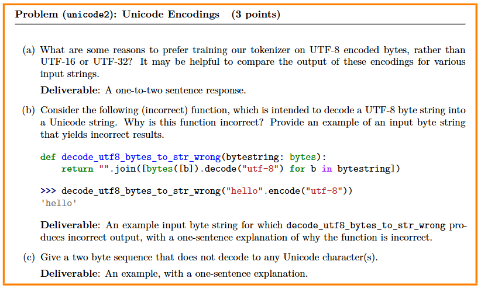

# Assignment 1: Building a Transformer LM{ignore true}

## 目录{ignore true}

[toc]

## 1 Byte-Pair Encoding (BPE) Tokenizer

### 1.1 Q1


(a) **A:** **chr(0)** 返回的是长度为1的 null 字符，不是空字符串。视觉上它"看不见"，但逻辑上它是一个真实存在的字符。
```shell
python -c "print(chr(0) == '\x00')"
```
可以得到**True**

(b) **A:** 打印得到的是空，但是实际上是由长度的null字符。
```shell
python -c "print(chr(0))"
python -c "print(chr(29275))"
```
可以看到差别

(c) **A:** 即使在字符间，null字符也不会显示。
```shell
python -c 'print("this is a test" + chr(0) + "string")'
> this is a teststring
```

### 1.2 Q2



(a) **A:** **UTF-8**相比较UTF-16、UTF-32更短一点，总共256词表size，1个字节即可完成编码，空间效率比较高；并且**UTF-8**没有字节序的问题，因为只有1个字节。

```shell
python -c 'print("hello! こんにちは!".encode("utf-8"))'
> b'hello! \xe3\x81\x93\xe3\x82\x93\xe3\x81\xab\xe3\x81\xa1\xe3\x81\xaf!'
python -c 'print("hello! こんにちは!".encode("utf-16"))'
> b'\xff\xfeh\x00e\x00l\x00l\x00o\x00!\x00 \x00S0\x930k0a0o0!\x00'
python -c 'print("hello! こんにちは!".encode("utf-32"))'
> b'\xff\xfe\x00\x00h\x00\x00\x00e\x00\x00\x00l\x00\x00\x00l\x00\x00\x00o\x00\x00\x00!\x00\x00\x00 \x00\x00\x00S0\x00\x00\x930\x00\x00k0\x00\x00a0\x00\x00o0\x00\x00!\x00\x00\x00'
```

(b) **A:** "中".encode("utf-8")（即字节串 b'\xe4\xb8\xad'），该函数会抛出 UnicodeDecodeError。
原因：该函数逐字节解码，而 UTF-8 中非 ASCII 字符（如"中"）由多字节序列组成，单独解码每个字节会破坏字符边界，导致无效的 UTF-8 序列。

(c) **A:** 示例：b'\xc0\x80'（或 b'\xff\xff'）。
该序列是无效的 UTF-8 编码：b'\xc0\x80' 属于过长编码（null 字符应单字节表示），而 b'\xff\xff' 包含非法起始字节（0xFF 不符合 UTF-8 任何有效字节模式），两者均无法解码为合法 Unicode 字符。

上述(b)、(c)想说的主要意思是，从 Unicode -> 8bit 的编码是唯一对应的，但是从 8bit -> Unicode 的解码并不是1个8bit对应1个或者半个Unicode这样唯一对应拼起来就行，随意可解的，有固定的规则。

### 1.3 BPE Tokenizer Training

训练主要包含三步：

#### 1.3.1 Vocabulary initialization (词表初始化)

这个作业训练的是Byte-level BPE，所谓Byte level，意思就是词表初始化时直接用的是Byte，也就是256大小的词表，对每个字节进行一对一映射。

#### 1.3.2 Pre-tokenization (预分词)

- 核心idea：如果直接对输入语料库进行分词的话，会遇到一个麻烦的事情是，如果要进行BPE的subword合并，那么就要持续不断的遍历整个词表，以找到两个subword(这里我们是Byte-level也就是两个Byte)相邻情况出现的次数。上述开销非常大，因此需要进行预分词，提前按照大粒度的进行分词，分完之后再统计相邻情况出现次数时，就不必遍历整个语料库了。

这里举了个例子：
```python
# 初始语句
low low low low low
lower lower widest widest widest
newest newest newest newest newest newest
# Pre-tokenization之后，我们拿到出现频次
{l,o,w: 5, l,o,w,e,r: 2, w,i,d,e,s,t: 3, n,e,w,e,s,t: 6}
# merge一次后，我们合并了出现频次最高的s,t为st，并将"st"添加到词表中
{l,o,w: 5, l,o,w,e,r: 2, w,i,d,e,st: 3, n,e,w,e,st: 6}
```

#### 1.3.3 Compute BPE merges (合并BPE子词)

这里主要介绍了一下合并的规则，没什么特别的，就是合并出现频率最高的几组词，如果多组词出现的频率一样，就合并“最大的”：
```python
>>> max([("A", "B"), ("A", "C"), ("B", "ZZ"), ("BA", "A")])
('BA', 'A')
```

- Special tokens

因为我们是Byte-level BPE，全部是字节匹配，特殊字符也会转化为字节码，因此在词表层面是无法感知到特殊字符的。本次作业中对特殊字符进行了去除，因为留着这些特殊字符可能会污染我们的相邻词语统计频次，例如："<|endoftext|>"。

### 1.4 训练前奏

#### 1.4.1 下载数据

可以参考作业的README，国内要通过镜像下载
```shell
# 解压完毕总共14GB，留足空间
wget --no-check https://hf-mirror.com/datasets/roneneldan/TinyStories/resolve/main/TinyStoriesV2-GPT4-train.txt
wget --no-check https://hf-mirror.com/datasets/roneneldan/TinyStories/resolve/main/TinyStoriesV2-GPT4-valid.txt
wget --no-check https://hf-mirror.com/datasets/stanford-cs336/owt-sample/resolve/main/owt_train.txt.gz
gunzip owt_train.txt.gz
wget --no-check https://hf-mirror.com/datasets/stanford-cs336/owt-sample/resolve/main/owt_valid.txt.gz
gunzip owt_valid.txt.gz
```

#### 1.4.2 Parallelizing pre-tokenization

这里提示了，预分词部分可能会非常慢，因为要遍历整个语料库，所以需要进行并行化，用multiprocessing就可以了。

#### 1.4.3 Removing special tokens before pre-tokenization

替换掉就可以了，但是要注意替换后不能让前后两个词拼在一起，解决办法就是替换为"|"这种字符

> **提示：** 
> 1. **Profiling:** 可以使用**cProfile**或者**scalene**
> 2. **Downscaling:** 先在小数据集上训练