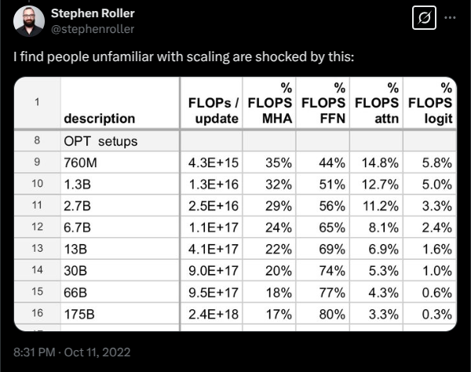
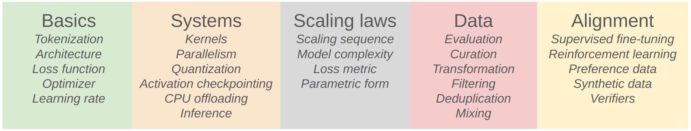
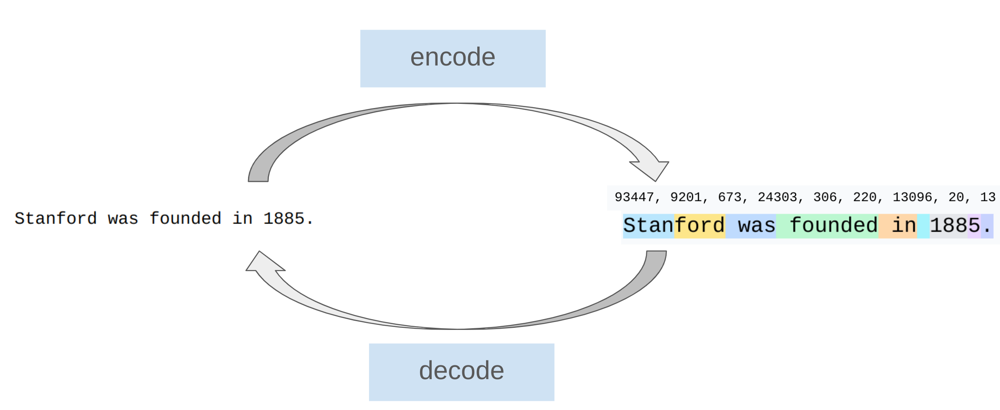
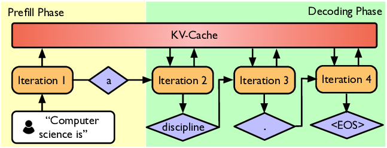

# lecture 01: Overview, tokenization

本节课主要是简单介绍了这门课程的教学内容和LLM的一些概述

## 1 Overview

- 现在LLM随着scaling尺度越来越大，基建已经变得越来越庞大，越来越难以用简单一门课程讲清楚所有细节，也越来越难以手搓出一个能用的预训练模型
- scaling尺度增加，attention和FFN在计算上的主导地位会发生变化，FFN的计算比重会随着模型增加越来越大，甚至超过80%，如下图所示：



- scaling尺度增加，模型会涌现越来越智能的现象

## 2 课程构成

### 2.1 课程目标

- 业界的LLM，一般需要考虑：



- 本门课程的目标是手搓一个可以work的"full pipeline"，主要包括以下几个部分：
    1. **tokenization**
    2. **model architecture**
    3. **training**

### 2.2 tokenization

tokenization实际上就是把自然语句分割、转化为一些整数拼接的序列(或者反过来)：



- 本门课程使用的是[Byte-Pair Encoding (BPE) tokenizer](https://arxiv.org/abs/1508.07909)
- 也有一些其他的"Tokenizer-free"训练方法，不过主流LLM用的很少，这里不展开

### 2.3 Architecture

- 这门课使用原始的transformer作为"starting point"
- 这里列举了主流模型中用到的一些其他算法/算子：
    - **Activation functions**: ReLU, SwiGLU: 激活函数，添加非线性
    - **Positional encodings**: sinusoidal, RoPE: 位置编码，给attention赋予位置感知能力
    - **Normalization**: LayerNorm, RMSNorm: 归一化算法，影响训练
    - **Placement of normalization**: pre-norm versus post-norm: 归一化方式，影响训练
    - **MLP**: dense, mixture of experts: 就是一个FFN
    - **Attention**: full, sliding window, linear: attention变种
    - **Lower-dimensional attention**: group-query attention (GQA), multi-head latent attention (MLA): 低秩注意力
    - **State-space models**: SSM，线性模型

### 2.4 Training

主要涉及以下几个概念：
- Optimizer: 优化器，影响训练参数收敛  
- Learning rate schedule: 学习率，影响训练参数收敛 
- Batch size: 训练批大小，影响训练效率
- Regularization: 正则化，例如dropout, weight decay等等
- Hyperparameters: 超参数，例如MHA中头的数量，feature维度等等，一般实验后择优调整

### 2.5 GPUs

粗略来说，GPU由SM、DRAM(HBM)、SRAM构成，而一般训练可能需要很多张GPU，这需要考虑以下优化角度：
- 组织计算方式，最小化数据搬运量或者瓶颈
- 合理编排网络流量，用计算掩盖通信
- 对训练参数在不同GPU上进行分片，并行训练
- 并行计算方式：DP、TP、PP、SP...

### 2.6 Inference

- 推理可能会部署后运行多次，而训练成功后一般不会再去训练
- 一般将推理划分为：prefill和decode



- prefill: 一般是compute bound，可以一次完成，也可以分片多次完成(chunked prefill)
- decode: 一次吐一个token，需要多轮迭代完成输出任务，优化方法：
    - 轻量化模型：剪枝、量化、蒸馏等等，降低模型decode开销
    - 投机推理：使用一个草稿模型去生成token，主模型打分并选择是否接受
    - 系统级别优化：KV caching, batching等等

### 2.7 scaling_laws

- 应该在小模型上去试运行，并依靠小模型来预测大模型的超参设置、损失的收敛情况等等

### 2.8 data

#### 2.8.1 Evaluation

应该如何来评估一个模型的好坏？
- **Perplexity**: 困惑度
- **Standardized testing** (e.g., MMLU, HellaSwag, GSM8K): 业界标准化benchmark测试
- **Instruction following** (e.g., AlpacaEval, IFEval, WildBench)
- **Scaling test-time compute**: chain-of-thought, ensembling 
- **LM-as-a-judge**: evaluate generative tasks 专门的语言模型来评判
- **Full system**: RAG, agents 整系统评估，例如添加RAG、agents这种下游任务

#### 2.8.2 Data curation && Data processing

- 数据来源一般是网页爬虫、获取专门的授权数据
- 数据处理一般包括：转换(all -> text)、过滤(去除有害信息)、去重(精简数据集)

### 2.9 alignment (模型对齐)

对齐的目标主要是：
- 让LM遵循指令
- 调整模型风格
- 调整模型安全性，规避有害回答

这里主要是两个模块：SFT和RLHF

#### 2.9.1 SFT (Supervised FineTuning, 有监督微调)

利用人工标注数据，对模型进行微调，SFT会更新模型权重

#### 2.9.2 RLHF (Reinforcement Learning from Human Feedbacks)

- 给出一系列回答，并提升人类更加偏好的回答方式，来对模型进行强化学习训练，RLHF会更行模型权重
- 可以用专门的评判模型来对RLHF结果做评判
- 算法：**PPO**(Proximal Policy Optimization)、**DPO**(Direct Policy Optimization)、**GRPO**(Group Relative Preference Optimization)等等

## 3 tokenization

### 3.1 an example

输入可能是"**Hello, 🌍! 你好!**"，经过tokenizer之后可能是 **[15496, 11, 995, 0]**(也有可能是反过来)，由此可见tokenization的主要功能是提供encode和decode方法，实现string<-->integer之间相互转换。

### 3.2 交互展示界面

可以使用[Tiktokenizer](https://tiktokenizer.vercel.app/?encoder=gpt2)来观察tokenizer是如何进行分词的。
- 前导空格归属在本词内作为同一个token，例如" hello"
- 词出现在不同位置可能对应着完全不同的integer，例如"hello hello"，第一个"hello"因为没有前导空格的原因，跟第二个"hello"不是一个编码数字
- 长数字每隔几位会被分词，例如"123456789"

### 3.3 Character-based tokenization

这是基于Unicode编码的分词器，缺点比较明显：
- 词表太大
- 很多词很少用，词表的实际使用效率很低

### 3.4 Byte-based tokenization

这是基于字节编码的分词器，缺点也比较明显：
- 虽然词表较小，一般就是256(也就是一个char的)大小，但是压缩率很差，因为每一个字符都对应一个编码，压缩率为1，encode之后的序列会变得非常长，而transformer是在token维度平方复杂度的...

### 3.5 Word-based tokenization

这时基于单词来进行分词，一个单词就是一个token，缺点也比较明显：
- 单词数量非常大，会让词表变得很臃肿
- 很多词很少用，词表的使用效率低
- 词表大小不固定，有可能会有新词产生

### 3.6 BPE(Byte Pair Encoding) tokenization

- 核心idea：在原始文本上训练分词器，自动生成词汇表
- 训练方法：将每个字节视为一个token(也就是首先以Byte-based为基础)，然后依次merge合并相邻token中最常见的一对，再次开启循环，直到达到了预定的```num_merges```次数
- 使用方法：使用上述tokenizer进行encode时也需要对输入的string进行merge，decode时就不需要了，直接map过去即可

### 3.7 总结

基于字符、字节、单词的分词方式缺点明显，效率较低或者是词表太大。BPE是一种较为有效的分词方式。