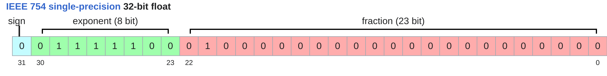
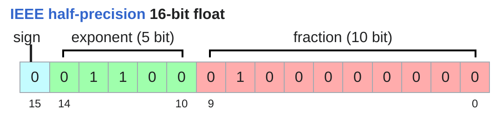
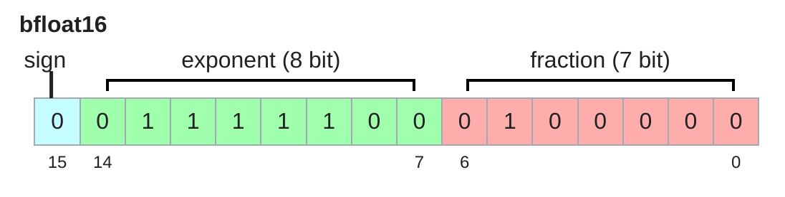
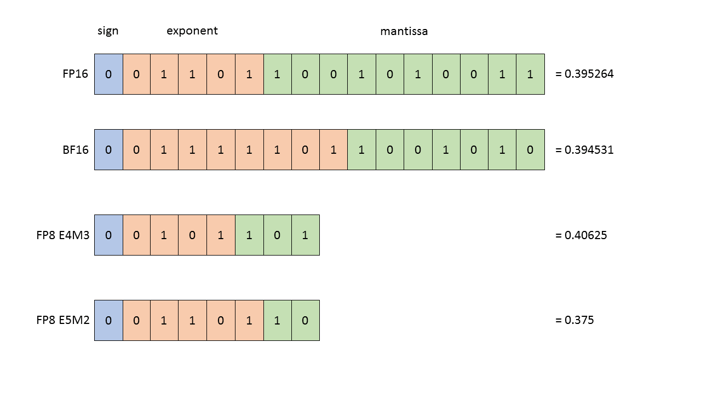
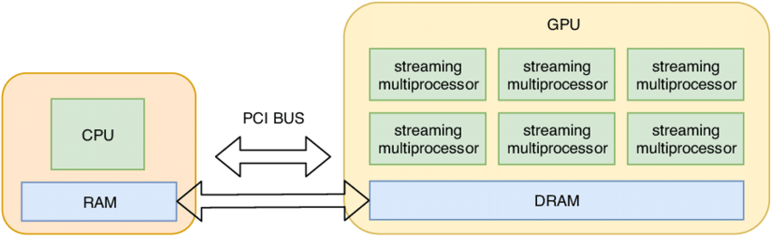

# lecture 02: PyTorch, resource accounting{ignore true}

## 目录{ignore true}

[toc]

## 1 餐巾纸估算法

1. 这里给了一个如何非常粗略的估算模型在对应机器上大概要训练多少天的方法：

- 假设模型参数量$P$，训练数据集大小$D$，训练卡的数量$N$，单张训练卡的理论算力$F$
- 总计算量约为：$6PD$，$6FLOPs/token/parameter$ 的经验法则来自[Kaplan et al., 2020](https://arxiv.org/abs/2001.08361?spm=a2ty_o01.29997173.0.0.4bdf51718KWeEH&file=2001.08361)，包括了前向 + 反向传播的开销
- GPU训练卡的计算能力上限约为：$0.5NF$，其中0.5为mfu估算值，偏高
- 运行天数约为：$12PD/NF$

2. 如何估算GPU最大能训练多大的模型？

拿显存大小除以平均每个参数占用byte即可。不同优化器算法、不同训练精度均有不同。

## 2 Transformer材料

- [The Transformer Model in Equations](https://johnthickstun.com/docs/transformers.pdf)
- [The Illustrated Transformer](https://jalammar.github.io/illustrated-transformer/)
- [The Illustrated GPT-2](https://jalammar.github.io/illustrated-gpt2/)
- [ransformer Memory Arithmetic: Understanding all the Bytes in nanoGPT](https://erees.dev/transformer-memory/)
- [Transformer FLOPs](https://www.adamcasson.com/posts/transformer-flops)

## 3 Pytorch

### 3.1 数据类型

一般训练使用的数据类型：float32, float16 bfloat16, fp8...

- **float32**


- **float16**

float16因为指数位变少了的缘故，可能会在训练时发生下溢、上溢等等，造成训练不稳定

- **bfloat16**


- **fp8**

FP8有两种形式，E4M3和E5M2

### 3.2 tensor

#### 3.2.1 operations
- tensor默认存储在CPU上，可在torch分配时指定或者分配后进行移动

- tensor默认行主序，可以通过`x.stride(dim)`来确认对应的stride
- tensor的`slice`、`view`、`transpose`等等不会进行copy，只是提供一个新的访存视角。`view`操作需要tensor首先必须是`contiguous`的
- tensor的`matmul`可以直接用`@`来计算，有超过2个维度时，`@`计算的是最后两个维度的矩阵乘
- 

#### 3.2.2 einops

基于爱因斯坦求和约定体系下的算子

##### 3.2.2.1 jaxtyping

```python
x: Float[torch.Tensor, "batch seq heads hidden"] = torch.ones(2, 2, 1, 3)
```

##### 3.2.2.2 einsum

```python
x: Float[torch.Tensor, "batch seq1 hidden"] = torch.ones(2, 3, 4)
y: Float[torch.Tensor, "batch seq2 hidden"] = torch.ones(2, 3, 4)
z = einsum(x, y, "batch seq1 hidden, batch seq2 hidden -> batch seq1 seq2")
# 也可以这样
z = einsum(x, y, "... seq1 hidden, ... seq2 hidden -> ... seq1 seq2")
```
没在`->`之后出现的维度就会被累加起来。

##### 3.2.2.2 reduce

```python
y = reduce(x, "... hidden -> ...", "sum")
```
最后指定的是reduce的方法，可以是：`min`, `max`, `sum`, `mean`, `prod`, `any`, `all`

##### 3.2.2.2 rearrange

```python
x = rearrange(x, "... (heads hidden1) -> ... heads hidden1", heads=2)
```
当然，用`reshape`也可以做

#### 3.2.3 flops

##### 3.2.3.1 单位
注意区分下面两个单位：
- **FLOPs**: floating-point operations
- **FLOPS(FLOP/s)**: floating-point operations per second

##### 3.2.3.2 MFU

- MFU: Model FLOPs utilization，`mfu = actual_flop_per_sec / promised_flop_per_sec`，一般50%就已经很高了

#### 3.2.4 gradients flops

这里介绍了自动微分计算中的flops是怎么算的
- 前向计算很简单，假如都是matmul的话，因为乘+加，所以系数是2
- 反向传播麻烦一点，假如都是matmul的话，因为一般要对 `C=A @ B` 中的`A` 和 `B`都求导，所以要再乘个2，系数就是4
- 所以前向+反向传播，前面的系数就是6，与前面的[餐巾纸估算法](#1-餐巾纸估算法)一致

### 3.3 models

#### 3.3.1 nn.Parameter

- 权重一般被存在这里
- 初始化时一般会进行scale缩放，乘一个`1/sqrt(input_dim)`，避免出现一些异常大的值。这里还做了正态分布初始化并进行了截断，截断范围是[-3,3]
```python
w = nn.Parameter(nn.init.trunc_normal_(torch.empty(input_dim, output_dim), std=1 / np.sqrt(input_dim), a=-3, b=3))
```

#### 3.3.2 训练

##### 3.3.2.1 随机数
很多地方都用到随机数，可以视情况设置固定或者变化的随机数种子，方便调试：
```python
# Torch
seed = 0
torch.manual_seed(seed)
# NumPy
import numpy as np
np.random.seed(seed)
# Python
import random
random.seed(seed)
```

##### 3.3.2.2 数据加载

```python
# NumPy lazily load
data = np.memmap("data.npy", dtype=np.int32)
```

##### 3.3.2.3 优化器

简单说了几种优化器：
- **momentum** = SGD + exponential averaging of grad
- **AdaGrad** = SGD + averaging by grad^2
- **RMSProp** = AdaGrad + exponentially averaging of grad^2
- **Adam** = RMSProp + momentum

这里实现的是**AdaGrad**优化器，核心是step函数的定义：
```python
    def step(self):
        for group in self.param_groups:
            lr = group["lr"]
            for p in group["params"]:
                # Optimizer state
                state = self.state[p]
                grad = p.grad.data
                # Get squared gradients g2 = sum_{i<t} g_i^2
                g2 = state.get("g2", torch.zeros_like(grad))
                # Update optimizer state
                g2 += torch.square(grad)
                state["g2"] = g2
                # Update parameters
                p.data -= lr * grad / torch.sqrt(g2 + 1e-5)
```
迭代公式如下：
$$
p_{t+1} = p_t - \frac{lr}{\sqrt{\sum_{i=1}^{t} g_i^2 + \epsilon}} \cdot g_t
$$
其中 $\epsilon=1e-5$ 防止除0错误。

**AdaGrad**的优点是，以累计梯度项作为分母，对过去训练历史中频繁更新的、更新幅度较大的参数，降低其本次更新的步长，实现一种自适应步长的更新。

#### 3.3.3 checkpoint

训练时可能会崩，所以需要保存检查点，方便定位原因和保存进展。保存和加载都非常简单：
```python
# 保存
checkpoint = {
    "model": model.state_dict(),
    "optimizer": optimizer.state_dict(),
}
torch.save(checkpoint, "model_checkpoint.pt")
# 加载
loaded_checkpoint = torch.load("model_checkpoint.pt")
```

#### 3.3.4 混精训练

核心idea：默认使用float32保证不会训崩，在能用低精度的时候尽可能使用低精度。
- https://pytorch.org/docs/stable/amp.html
- https://docs.nvidia.com/deeplearning/performance/mixed-precision-training/