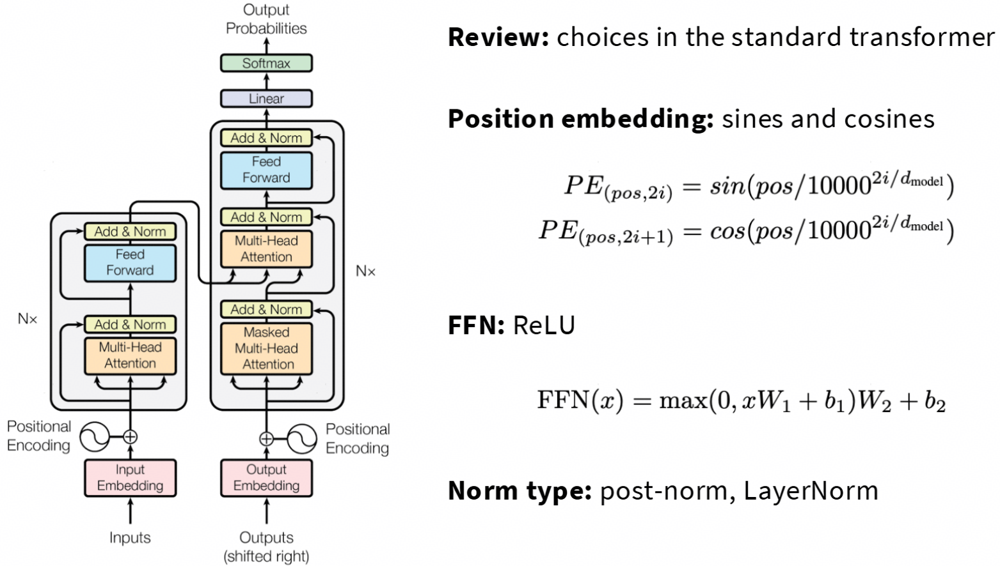
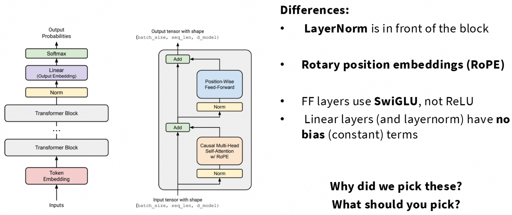
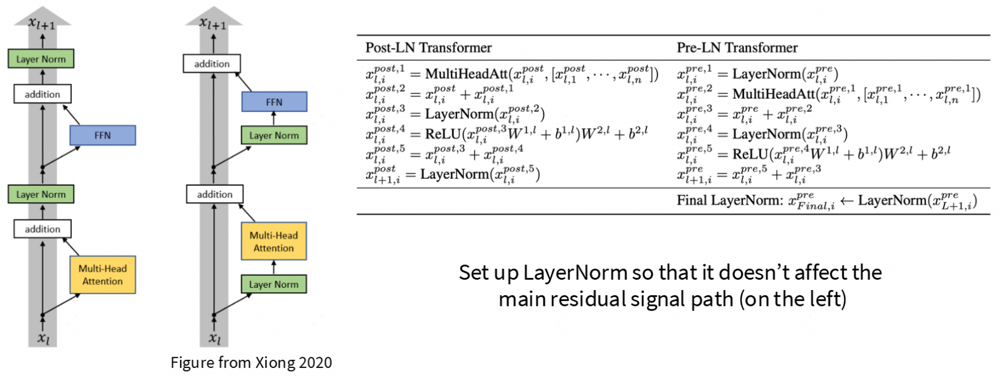
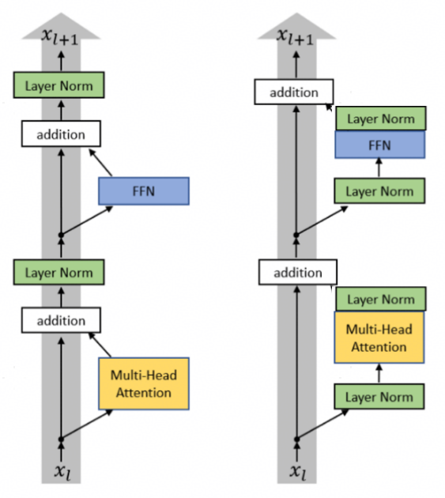
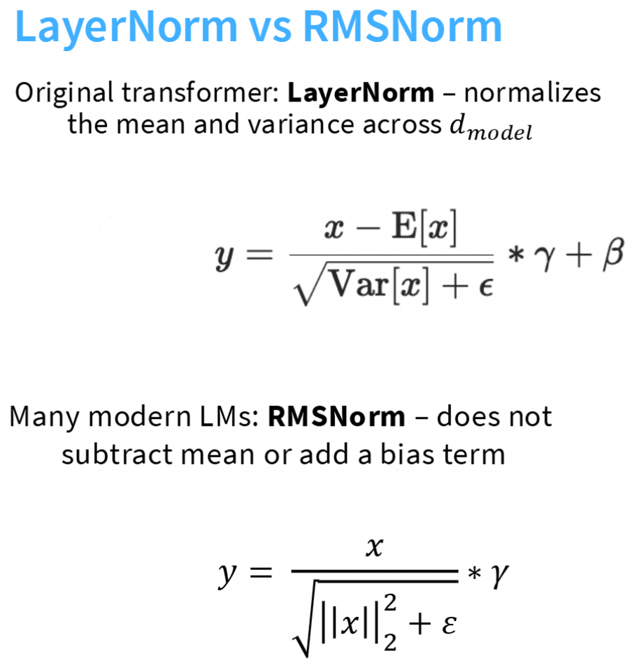
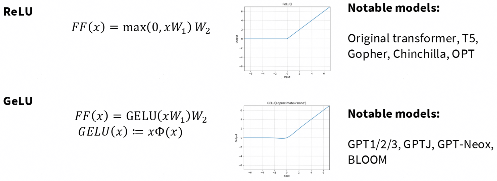
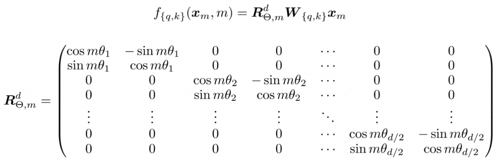
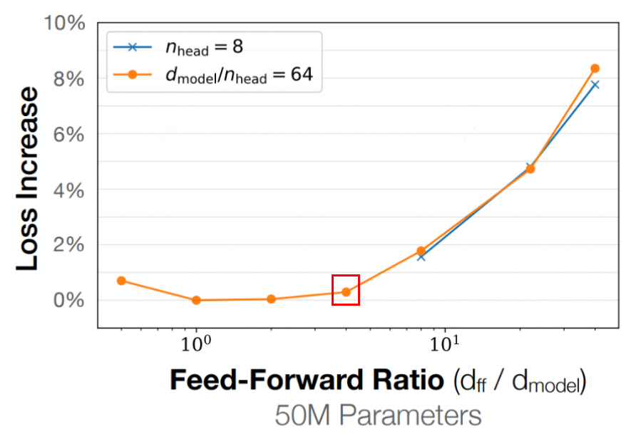
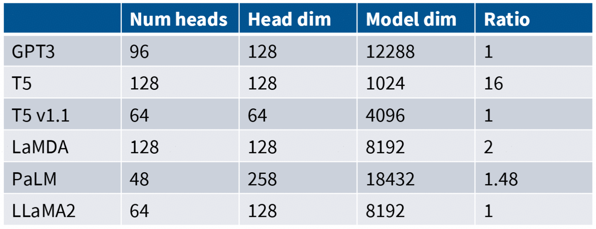
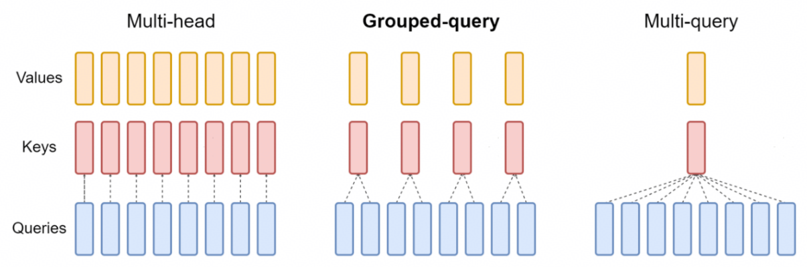

# lecture 03: architecture and variant {ignore true}

## 目录{ignore true}

[toc]

## 1 transformer and variant

这里主要介绍transformer架构的一些变体

### 1.1 standard transformer

标准transformer长这样：

### 1.2 assignment 1 verison

作业一中实现的长这样：

可以看到，这里只有docoder解码器，没有encoder，是decoder-only的。

### 1.3 variations

一般架构发生变化的地方在：
- 激活层，FFN
- attention变种，例如MHA、MQA、MLA
- 位置编码

超参数：
- ff_dim是什么？multi_head_dim的总和一定是model_dim吗
- 词表元素大小是多少个？

下面讨论各个变种的优劣情况：

#### 1.3.1 LayerNorm

##### 1.3.1.1 pre-norm VS. post-norm

除了(BERT)以外几乎所有的语言模型都使用pre-norm，他们俩的区别见下图，只有layer-norm摆放的位置不同：
- **pre-norm在attenton、FFN之前，并且不会摆放在residual stream上，残差不会被layer-norm影响。**

[Xiong 2020] 论文对比了pre-norm和post-norm的影响，pre-norm的训练稳定性和效率是更高的。现在也有新模型将所谓的"post-norm"(其实应该叫second-norm)放在residual stream外面，不过还是没有丢弃掉pre-norm，形成一种**double-norm**：

##### 1.3.1.2 LayerNorm VS. RMSNorm

现在很多模型使用RMSNorm，比如deepseek-V3等等，而不是最初transformer内的LayerNorm：

可以看到RMSNorm的计算做了简化，这也是RMSNorm的优势：
- **计算更少**：不计算平均值
- **参数量更少**：没有bias参数项。除了RMSNorm外，现在主流LLM里面很多地方的bias项也都被去掉了，例如FFN，这有利于减轻计算、内存资源使用以及训练稳定性
- **工程效果更好**

这里引出一个问题是：现在大模型的主要计算都在矩阵乘上，RMSNorm这一点计算量不会有什么影响，那么RMSNorm计算量更少的优势还仍然成立吗？
- 答案是仍然成立，因为LayerNorm到RMSNorm的切换会影响数据搬运，也就是计算访存比。

##### 1.3.1.3 总结

**LayerNorm**现在一般都是**pre-norm+RMSNorm**的形式：
- pre-norm:
    - 不干扰残差连接，训练稳定，梯度传播更加稳定，毛刺更少
- RMSNorm:
    - 与LayerNorm工作的一样好，但是使用的参数量、计算量更小
    - 相比LayerNorm去掉了bias项，在很多模块都有这种情况，例如FFN

#### 1.3.2 Activation

##### 1.3.2.1 ReLU (Rectified linear unit)

一般是这种形式：
$$
    f(x) = max(0, x)
$$

在FFN中，是这样的，也就是放在两层linear中间
$$
    FF(x) = max(0, xW_1)W_2
$$

##### 1.3.2.2 GeLU (Gaussian Error Linear Unit)

一般是这种形式：
$$
    f(x) = x\Phi(x) = x \cdot \frac{1}{2} [1 + erf(\frac{x}{\sqrt{2}})]
$$
- 其中$\Phi(x)$是标准正态分布的累积分布函数(CDF)
- $erf(⋅)$是误差函数(error function):
$$
\begin{aligned}
PDF: \; \phi(x) &= \frac{1}{2\pi} e^{-x^2/2} \\
CDF: \; \Phi(x) &= \int_{-\infty}^x \phi(t) \cdot dt \\
erf: \; erf(x) &= \frac{2}{\sqrt{\pi}} \int_0^x e^{-t^2} \cdot dt
\end{aligned}
$$

但是$erf$是超越函数，计算成本较高，实际一般用$tanh$来代替(有理逼近)：
$$
\begin{aligned}
    FF(x) &= GELU(xW_1)W_2 \\
    GeLU(x) &\approx \frac{1}{2} x [1 + tanh(\frac{2}{\sqrt{\pi}}(x+0.044715x^3))]
\end{aligned}
$$

- GELU可以理解为：对输入$x$，以概率$\Phi(x)$保留原值，否则置零。这种“软门控”机制使其在保持非线性的同时，比ReLU更平滑，梯度更稳定。

##### 1.3.2.3 Gated Activations (*GLU)

就是加了一个门控，ReLU->ReGLU belike:
$$
    FF_{ReGLU}(x) = (max(0, xW_1) \odot (xV)) W_2
$$
门控因子就是$xV$，同理也有GeGLU:
$$
    FF_{GeGLU}(x) = (GeLU(xW_1) \odot (xV)) W_2
$$
SwiGLU:
$$
\begin{aligned}
    FF_{SwiGLU} &= (Swish(xW_1) \odot (xV)) W_2 \\
    swish(x) &= x \odot sigmoid(x) = \frac{x}{1+e^{-x}}
\end{aligned}
$$

##### 1.3.2.4 总结

- 激活函数有很多变种，一般用的最多的是**ReLU**、**GeLU**、**\*GLU**(gated门控版本)
- 激活函数中的gate(**\*GLU**)不是必需品，但是大多情况下都有帮助

#### 1.3.3 parallel layers

之前都是先做attention，再做MLP，很少有模型并行着做：
$$
    y = x + MLP(RMSNorm(x + Attention(RMSNorm(x))))
$$
并行版本的长这样：
$$
    y = x + MLP(RMSNorm(x)) + Attention(RMSNorm(x))
$$

并行版本的收益在于：
- 可以共享$RMSNorm(x)$
- attenton、MLP的矩阵乘可以做算子融合

#### 1.3.4 position embeddings

##### 1.3.4.1 sine embeddings

顾名思义就是用正弦函数来做位置编码，原始transformer里面就是这样做的：
$$
\begin{aligned}
Embed(x, i) &= x + PE_{pos} \\
PE_{(pos,2i)} &= \sin\left(\frac{pos}{10000^{2i/d_{\text{model}}}}\right) \\
PE_{(pos,2i+1)} &= \cos\left(\frac{pos}{10000^{2i/d_{\text{model}}}}\right)
\end{aligned}
$$

| 符号 | 含义 | 取值范围 | 确定方式 |
|------|------|----------|----------|
| **`pos`** | token在序列中的**绝对位置索引** | $0, 1, 2, ..., L-1$ | 由输入序列长度 $L$ 决定 • 第1个token → `pos=0` • 第2个token → `pos=1` • ... |
| **`i`** | 位置编码向量的**维度索引** | $0, 1, 2, ..., d_{\text{model}}-1$ | 由embedding维度决定 • 偶数维度（0,2,4...）用 `sin` • 奇数维度（1,3,5...）用 `cos` |
| **`d_model`** | 模型的**embedding维度**（隐藏层维度） | 超参数（如768, 1024, 4096） | 由模型架构设计决定 • BERT-base: 768 • LLaMA-7B: 4096 |

可见，对于隐藏层维度方向的每一个值，都有对应的i以及对应的频率，捕获对应的不同窗口的位置信息：
> - 低维度（小 `i`）→ 高频振荡 → 捕获**局部位置**差异  
> - 高维度（大 `i`）→ 低频振荡 → 捕获**全局位置**趋势  
> - `10000` 是缩放常数，确保 `pos` 在合理范围内变化

- 优势
    - ✅ 无需训练参数，节省内存
    - ✅ 支持序列外推（处理比训练更长的序列）
    - ✅ 通过三角恒等式隐式编码相对位置关系
    - ✅ 多频率设计：低频捕获长程依赖，高频捕获局部模式

- 劣势
    - ❌ 固定模式，无法任务自适应
    - ❌ 长序列中高频维度区分度下降
    - ❌ 位置与语义简单相加，缺乏深度交互

##### 1.3.4.2 absolute embeddings

- **可学习型**：通过Embedding层训练

$$
\begin{aligned}
    Embed(x, i) &= x + PE_{pos} \\
    PE_{pos} &\in \mathbb{R}^{L_{\max} \times d}
\end{aligned}
$$

- 优势
    - ✅ 可学习型能根据任务自适应优化
    - ✅ 实现简单，直接与token embedding相加
    - ✅ 中短序列任务训练稳定

- 劣势
    - ❌ 长度受限（$L_{\max}$截断），无法外推
    - ❌ 缺乏相对位置归纳偏置
    - ❌ 可学习型需额外参数（$L_{\max} \times d$）

##### 1.3.4.3 relative embeddings

$$
    e_{ij} = \frac{x_iW^Q(x_jW^K+a_{ij}^{K})^T}{\sqrt{d_z}}
$$

| 符号 | 含义 |
|------|------|
| $x_iW^Q$ | 位置 $i$ 的 **Query 向量**（内容信息） |
| $x_jW^K$ | 位置 $j$ 的 **Key 向量**（内容信息） |
| $a_{ij}^{K}$ | **相对位置编码向量**，仅依赖相对距离 $r = i-j$ |
| $d_z$ | 注意力头的维度（缩放因子） |
| $e_{ij}$ | 位置 $i$ 对位置 $j$ 的注意力分数 |

也就是在attention计算时的K后边加一个相对的位置编码，而不是直接与$x$相加了。

- 优势
    - ✅ **平移不变性**：相同相对距离（如相邻词）在不同位置获得相同位置编码
    - ✅ **更强归纳偏置**：直接告诉模型"前后相邻"比"相隔10个词"更重要
    - ✅ **支持外推**：训练时未见的长序列仍能合理计算相对距离

##### 1.3.4.4 RoPE (rotary position embeddings)

###### 1.3.4.4.1 核心思想
通过**旋转向量**将绝对位置信息编码到embedding中，使得注意力计算天然具备相对位置感知能力：
$$
\langle f(x_m, m),\ f(x_n, n) \rangle = g(x_m, x_n, m-n)
$$
即：两个旋转后向量的内积**仅依赖于相对距离** $m-n$，而非绝对位置 $m, n$。

###### 1.3.4.4.2 数学形式

- 2D旋转矩阵
对每对相邻维度 $(x^{(2i)}, x^{(2i+1)})$ 应用旋转：
$$
\begin{bmatrix}
x^{(2i)} \\ x^{(2i+1)}
\end{bmatrix}
\longmapsto
\begin{bmatrix}
\cos m\theta_i & -\sin m\theta_i \\
\sin m\theta_i & \cos m\theta_i
\end{bmatrix}
\begin{bmatrix}
x^{(2i)} \\ x^{(2i+1)}
\end{bmatrix}
$$
其中 $\theta_i = 10000^{-2i/d}$，$m$ 为位置索引。

- 紧凑形式（复数表示）
$$
f(x, m)_i = x \cdot e^{\mathrm{i} m \theta_i} \quad (\text{取实部/虚部对应相邻维度})
$$

- 高维形式

###### 1.3.4.4.3 为什么能编码相对位置？
利用三角恒等式：

$$
\begin{aligned}
&\langle f(x_m, m),\ f(x_n, n) \rangle \\
&= x_m x_n \cos((m-n)\theta_i) \\
&= \text{仅依赖相对距离 } (m-n)
\end{aligned}
$$

→ 模型无需显式计算 $m-n$，**内积自动蕴含相对位置信息**。

- 优势
    - ✅ **天然外推**：旋转操作对任意 $m$ 有定义，支持超长序列推理
    - ✅ **理论优雅**：基于旋转群 $SO(2)$ 的数学性质，位置关系保持几何一致性
    - ✅ **无需修改注意力结构**：仅预处理Q/K，兼容标准注意力实现
    - ✅ **长序列性能优异**：LLaMA、ChatGLM等大模型首选方案

- 劣势
    - ❌ **高频维度饱和**：长序列中 $\cos(m\theta_i)$ 振荡过快，区分度下降（需NTK-aware插值等扩展）
    - ❌ **实现需复数/分组操作**：比简单加法复杂，需注意维度配对
    - ❌ **训练-推理不一致风险**：外推时旋转角度超出训练分布，可能影响质量（需缩放策略缓解）

- 与正弦编码关系
    - 正弦编码：$PE(m) = [\sin(m\theta), \cos(m\theta)]$ → **加到embedding上**
    - RoPE：将 $x$ 旋转 $m\theta$ 角度 → **变换embedding本身**
    - 本质：RoPE是正弦编码的**几何升级版**，从"加法融合"变为"旋转变换"

#### 1.3.5 hyperparameters (超参数)

##### 1.3.5.1 FFN dim

下图中，$d_{ff}/d_{model}=4$这个点基本上就是loss开始增大的拐点了。

所以一般设置$d_{ff} = 4 d_{model}$，也有例外：[GLU](#1323-gated-activations-glu)一般设置为$d_{ff} = \frac{8}{3} d_{model}$

##### 1.3.5.2 num_heads head_dim and model_dim

事实上，这三个参数的关系并不一定是：$num\_heads \times head\_dim = model\_dim$，这里定义：
$$
    ratio = \frac{num\_heads \times head\_dim}{model\_dim} \ge 1
$$

部分模型的$ratio$并不是1，但大部分模型还是保持1：

##### 1.3.5.3 aspect ratio

定义为：$aspect\_ratio = d_{model}/n_{layer}$，也就是模型feature维度除以模型层数，这实际上就是模型的“宽度”与模型“深度”的比值，可见：

- aspect ratio越大，模型约胖，深度不够，理解能力可能变弱
- aspect ratio越小，模型越瘦，深度太深，模型并行能力不足，吞吐延时增加

一般主流模型都设置aspect ratio在100~200之间

##### 1.3.5.4 vocab size

一般设置30~250k

##### 1.3.5.5 dropout and weight decay

都是预训练中的正则化技术。

###### 1.3.5.5.1. Dropout

- 核心思想
训练时**随机屏蔽**神经网络中的一部分神经元（置零），迫使网络不依赖特定神经元，提升泛化能力。

- 数学形式
$$
y = \frac{1}{1-p} \cdot (x \odot m), \quad m \sim \text{Bernoulli}(1-p)
$$
- $p$：dropout率（如0.1表示屏蔽10%神经元）
- $m$：随机掩码向量
- $\odot$：逐元素乘
- $\frac{1}{1-p}$：推理时缩放补偿（Inverted Dropout）

- 作用机制

| 阶段 | 操作 | 目的 |
|------|------|------|
| **训练** | 每步随机屏蔽 $p$ 比例神经元 | 破坏共适应（co-adaptation），模拟模型集成 |
| **推理** | 所有神经元激活，输出乘 $(1-p)$ | 保持期望输出与训练一致 |

- 优势
    - ✅ 有效缓解过拟合，尤其在大模型/小数据场景
    - ✅ 计算开销低（仅掩码操作）
    - ✅ 与BatchNorm等技术兼容性好

- 劣势
    - ❌ **预训练中通常设为0或极小值**（如0.1）：
    - 预训练数据量极大（千亿token），过拟合风险低
    - Dropout破坏语言建模的连续性，损害长程依赖学习
    - 实证：LLaMA、GPT-3预训练禁用dropout，仅在微调时启用
    - ❌ 增加训练方差，收敛速度略慢

###### 1.3.5.5.2. Weight Decay（权重衰减）

- 核心思想
在损失函数中添加**L2正则项**，约束权重幅度，防止模型过度复杂化。

- 数学形式
$$
\mathcal{L}_{\text{total}} = \mathcal{L}_{\text{task}} + \lambda \sum_{\theta} \|\theta\|^2_2
$$
- $\lambda$：weight decay系数（典型值 $0.01 \sim 0.1$）
- 优化器更新等价于：
  $$
  \theta \leftarrow \theta - \eta \nabla\mathcal{L} - \eta\lambda\theta = (1-\eta\lambda)\theta - \eta \nabla\mathcal{L}
  $$

- 与L2正则化的关系

| 优化器 | Weight Decay实现 | 注意事项 |
|--------|------------------|----------|
| **SGD** | 等价于L2正则化 | $\theta \leftarrow (1-\eta\lambda)\theta - \eta\nabla\mathcal{L}$ |
| **AdamW** | **解耦实现**（推荐） | 先衰减权重，再计算梯度： $\theta \leftarrow (1-\lambda)\theta - \eta \cdot \text{AdamUpdate}$ |
| **Adam** | 与L2不等价（有缺陷） | 梯度归一化破坏衰减效果，**不推荐** |

> 📌 **关键区别**：AdamW是Adam的修正版，专为正确实现weight decay设计，已成为预训练标准（LLaMA、BERT均使用）。

- 优势
    - ✅ 抑制权重爆炸，提升训练稳定性
    - ✅ 防止注意力机制中某些头主导（attention collapse）
    - ✅ 与学习率解耦（AdamW），调参更鲁棒

- 劣势
    - ❌ 过大 $\lambda$ 会损害模型容量，降低性能上限
    - ❌ 对不同参数组需差异化设置（如LayerNorm/bias通常设 $\lambda=0$）

| 技术 | 典型值 | 原因 |
|------|--------|------|
| **Dropout** | 0.0 ~ 0.1 | 数据量大，过拟合风险低；高dropout损害语言建模 |
| **Weight Decay** | 0.01 ~ 0.1 (AdamW) | 稳定训练，防止权重发散；LayerNorm/bias设为0 |
| **Attention Dropout** | 0.0 ~ 0.1 | 仅在注意力权重上应用，比全连接层更安全 |

#### 1.3.6 训练稳定性

可以看训练的loss和梯度L2范数来确定训练是否是稳定的，稳定的训练上述两个指标应该是稳定、毛刺较少的。

- softmax因为起指数计算的操作，可能导致矩阵病态，引起训练不稳定

#### 1.3.7 attention variant

##### 1.3.7.1 GQA/MQA

- 核心idea：减少头的数量来降成本，主要是因为推理时候算数强度低，减少头的个数可以降低KV cache的访存量

MQA只保留K、V的一个头，这样KV cache换入换出的访存成本就会降低$h$倍。GQA则是对query进行分组，每一组访问一个组内的KV

##### 1.3.7.2 sparse/slide attention

- 核心idea：访问整段上下文成本较高，只稀疏跳跃着访问降低成本，或者只访问窗口内部的KV

> 现在很多模型使用interleave的方案，也就是有的层是全注意力，有的层是稀疏注意力，交织排列

### 1.4 总结

主流模型很多地方存在变种，包括但不限于：
- 位置编码
- 激活层
- 分词器
- attention

主流的模型通常采用：
- RoPE
- RMSNorm+PreNorm