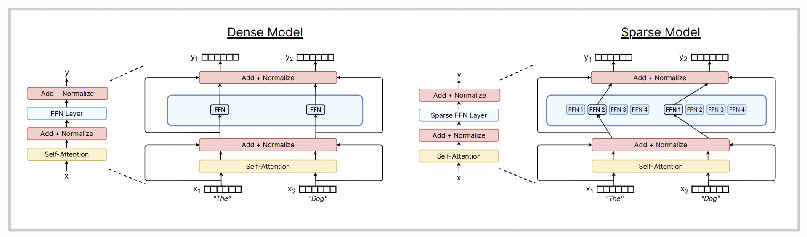
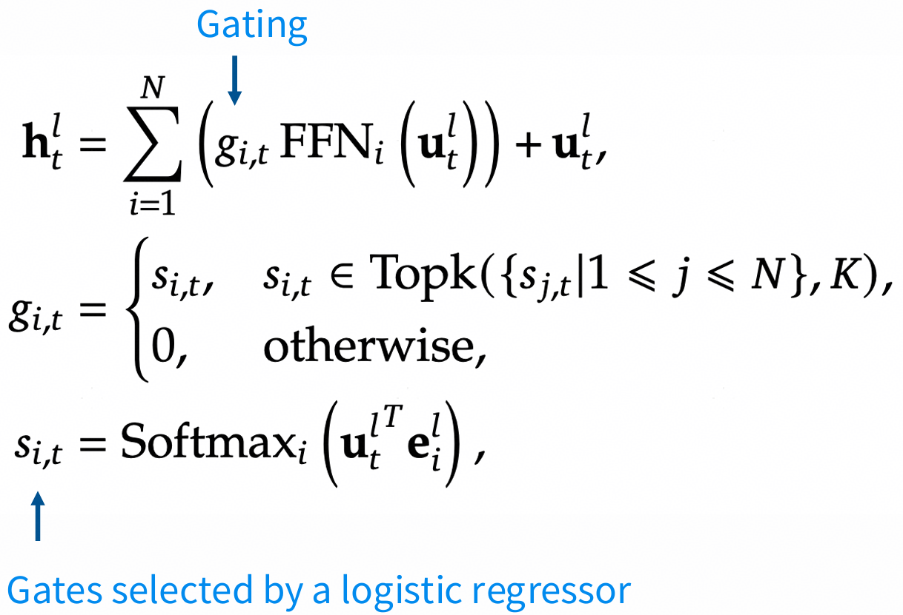
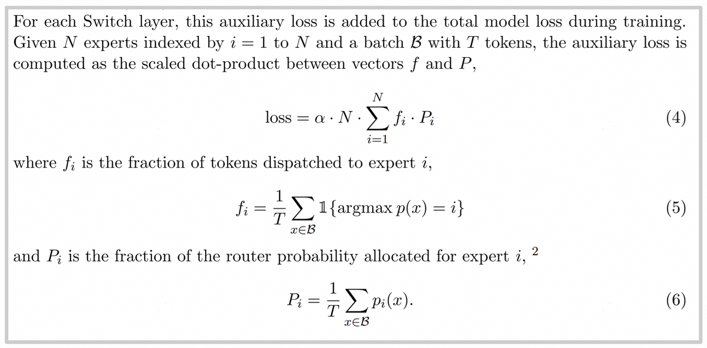
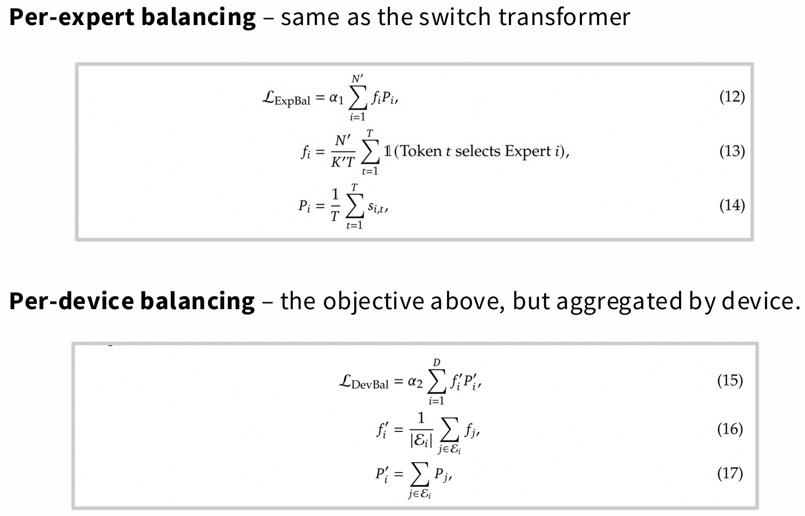
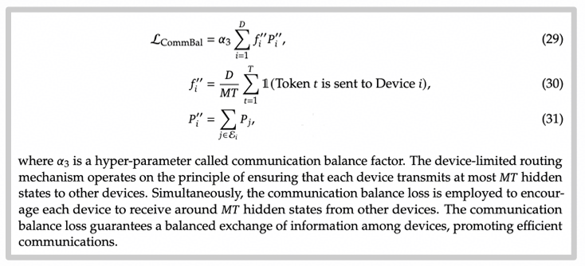
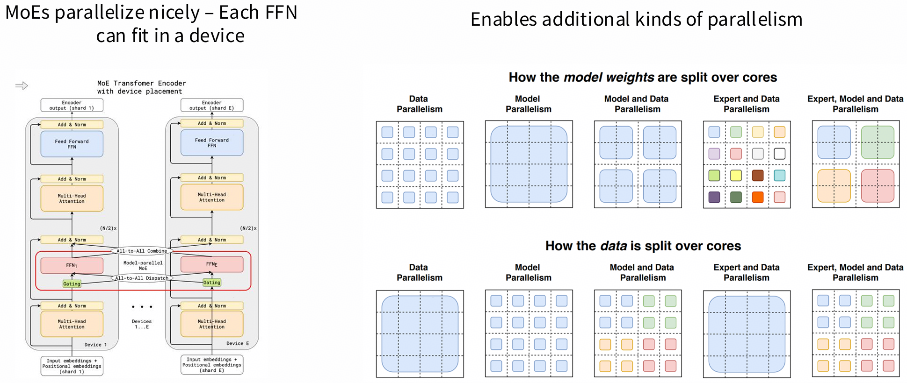
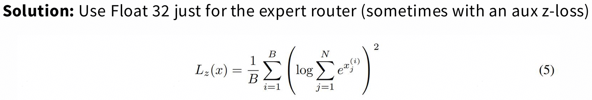
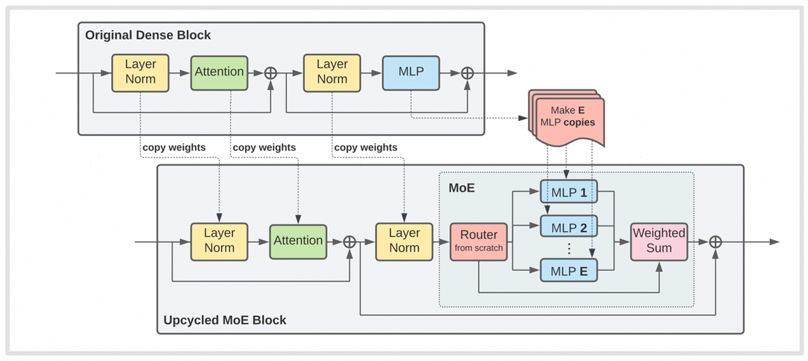

# lecture 03: MoE {ignore true}

## 目录{ignore true}

[toc]

## 1 MoE 简介 (Mixtures Of Experts)

下面这张图比较直观，列出了MoE跟正常MLP的主要区别：

## 2 MoE 特点
MoE的好处主要是：

- 训起来快
- 相同FLOPS下，比稠密模型表现更好
- 可专家并行
缺点是：
- 训起来相对稠密模型会不稳定
- infra更加复杂

MoE一般针对的是MLP层，而不是attention层

## 3 MoE 模块及变种

### 3.1 Routing function (路由函数)

其实MoE可以有如下几种选择，但几乎所有的模型里面都是token choose Top-K experts

#### 3.1.1 variants
- hash routing：也就是通过将输入哈希到对应的专家，而不是对专家进行打分后再选择top-k。一般作为对比的基线使用
- RL to learn routes：可学习router，现在已经不常见了
- BASE routig：将路由认为一个线性分配问题

#### 3.1.2 top-k routing

比较经典的是下面这种top-k路由方法，deepseek-v3也是采用的这种办法：

核心idea：用FFN的输入来做一个softmax打分，从而选择top-k分数最高的专家进行路由，最后再加上共享专家的部分。

### 3.2 Expert sizes (专家大小)

MoE的一些消融实验证明，专家数量、共享专家数量的增加对模型的性能是有帮助的。

### 3.3 Training objectives (训练目标)

训练的挑战在于，MoE稀疏模型提升了训练效率，但是也有问题：
- **专家负载不均衡（expert imbalance）**：某些专家被频繁使用，而其他专家几乎不用（“赢者通吃”现象）。
- 导致：参数浪费、训练不稳定、泛化能力下降。

#### 3.3.1 Heuristic balancing losses (启发式负载均衡损失)

PPT里给了Switch Transformer的公式：

看公式可能比较复杂，但是实际上很简单，就是在原本的训练loss上新增了一个**balance loss**，用它来衡量MoE网络里的负载均衡情况，其中：
- **$f_i$:** 代表当前expert处理了多少比例的token，很明显，绝对均衡下的期望是$1/N$
- **$P_i$:** 代表门控网络对当前expert的偏好，绝对均衡下的期望是$1/N$

再配合上前面的$N \cdot \sum_{i=1}^N$ ~ 姑且认为是$N^2$，实际上绝对均衡时**balance loss**的期望就是1，并且整个式子的表达形式正好符合我们对loss的印象（是一个**expert维度**的**二阶项**）。所以deepseekV1~V2里也把这一项叫$\mathcal{L}_{ExpBal}$，意为expert维度的负载均衡损失项，并且deepseekV1~V2中还新增了device项和communication项：

#### 3.3.2 并行训练

这里给了一张比较经典的MoE并行方法图：

### 3.4 MoE 问题

- 随机性：infra写的不好，例如限定死每个expert的容量，超出的直接丢弃掉，可能会引起吐字异常。假如有多个batch同时进来，那么有可能batch之间会相互冲刷，也就是一个回答会被另一个回答影响。
- 稳定性：MoE top-k 选择会有稳定性问题，所以一般用float32来做expert router，但也不能保证float32就不会出问题。Z-loss可以规避这个问题：

- SFT过拟合：MoE稀疏模型似乎更容易过拟合，解决办法是用更多的微调数据

### 3.5 其他训练方法

上述问题引出其他训练方法，假设现在已经有一个预训练好的稠密模型了，那么可以直接用来初始化MoE模型：

## 4 deepseek V1~V3

最后花几页PPT介绍了一下deepseek V1~V3，关于MLA的推导这里不再详述