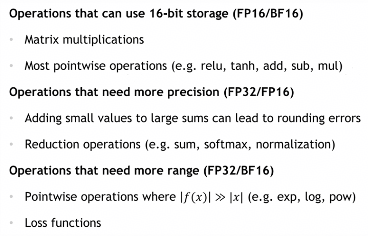
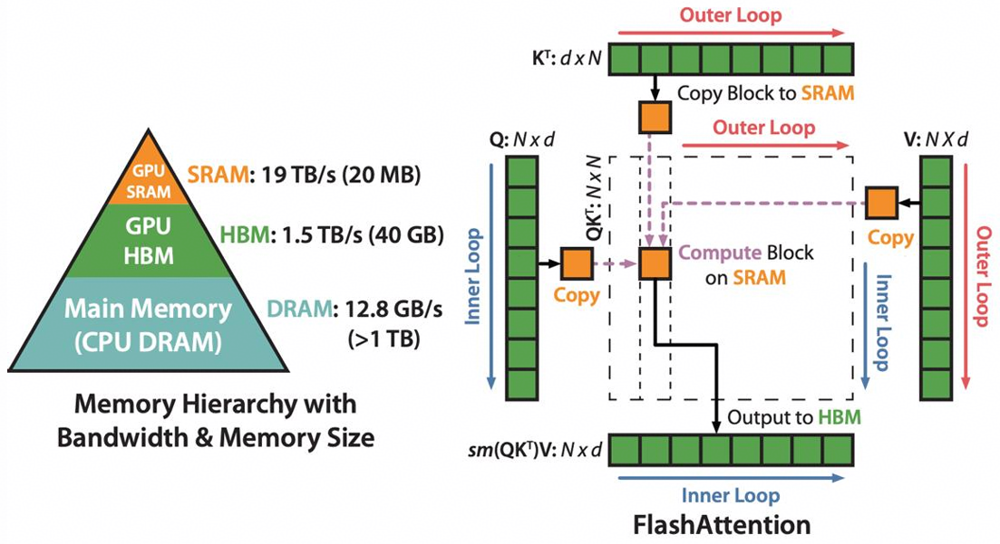
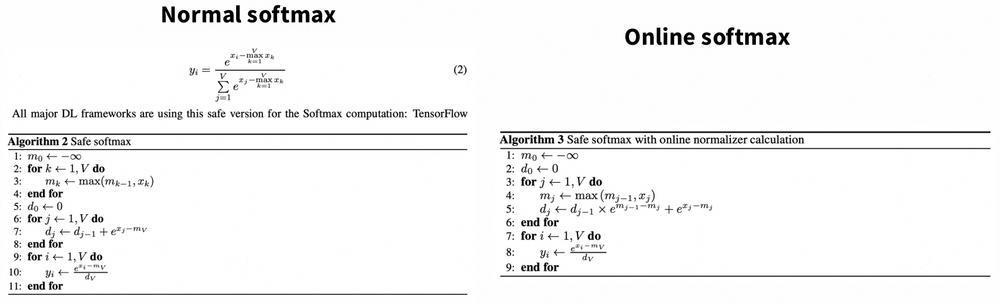
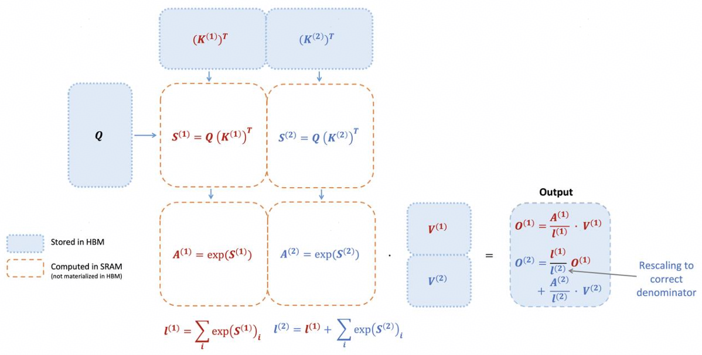

# lecture 05: GPUs {ignore true}

## 目录{ignore true}

[toc]

## 1 GPU 简介

略

## 2 performance

### 2.1 Low precision computation

低精计算带来的收益主要是两个方面：
- 降低计算量
- 降低访存量

下面列举了几个ops对应的精度需求：



### 2.2 Operator fusion

torch可以帮助做一些算子层面的简单融合，前提是不开eagle模式，例如：
```
x1 = x.cos()
x2 = x1.cos()
--->
x2 = x.cos().cos()
```
这样做的好处是，可以减少访存量，不用反复读取，以及减少调度层面的开销，让算子变得更大，CPU调度时间也可以被更好的掩盖掉。

### 2.3 recomputation

为了快速计算反向传播时的梯度，我们存了每一步计算时的pytorch自动微分值，但实际上这些值的读写也很耗时间，不如直接重新去计算。

### 2.4 Memory coalescing and DRAM

这里主要介绍的是合并内存读写，GPU每个warp的写入是合并的，不用担心会出现缓存一致性问题，因此也就没有伪共享问题。所以GPU的内存读写方式决定GPU反而要把每个线程访问的内存尽量排布在一起，以触发内存读写事务合并，提升带宽利用率。

### 2.5 tiling

gemm里常用的分块计算方法，主要是可以把数据放在shared memory里，增加数据的利用效率，降低访存量。影响tiling size的因素主要是：
- 内存访问合并：尽量让内存对齐（aligned），有时矩阵的shape不支持百分百对齐，那么就可以去做padding
- 共享内存大小
- 矩阵维度的可分性

### 2.6 总结

优化方式主要是一下三点：
1. 降低访存量
    - 内存合并
    - 算子融合
2. 善用shared memory
    - tiling矩阵分块
3. 访存与计算or精度之间的trade-off
    - 量化
    - 重计算

## 3 FlashAttention

### 3.1 公式回顾

$$
    Attention(x) = softmax(\frac{XQ(XK)^T}{\sqrt{d_k}}) \cdot XV
$$

### 3.2 matmul

就是正常的矩阵分块方法：


### 3.3 softmax

softmax为了计算安全，做了变式，上下都除以了$e^{x_m}$，限制了数值不会太大而导致溢出。
$$
\begin{align}
    x_m &= max(X) \\
    y_i &= \frac{e^{x_i-x_m}}{\sum{{e^{x_j-x_m}}}}
\end{align}
$$

下面是FlashAttention2做的online softmax：


可以看到，online softmax做的操作实际上就是将normal softmax的前两个循环合并为了一个循环，这样做的好处就是可以减少访存量。

### 3.4 总体

总的来说就是这样：

