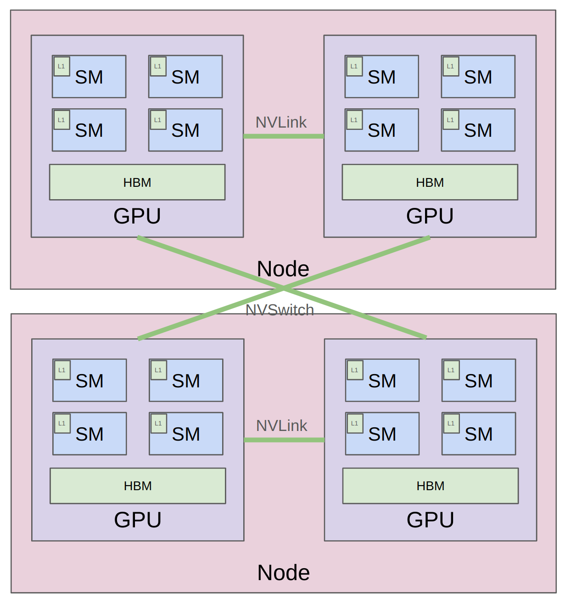

# lecture 8: PARALLELISM BASICS {ignore true}

## 目录{ignore true}

[toc]

## 1 介绍

这里首先给了张网络拓扑图，通信方式一般是：

- 单节点，单GPU：L1 cache / shared memory / HBM
- 单节点，多GPU：NVLink，bypass掉CPU，PCIe
- 多节点，多GPU：NVSwitch，bypass掉CPU，Ethernet

## 2 分布式计算

分别介绍了集合通信术语、torch distributed、

### 2.1 集合通信术语

**Broadcast**、**Scatter**、**Gather**、**Reduce**、**All-gather**、**Reduce-scatter**、**All-reduce = reduce-scatter + all-gather**等等，不再详细展开，参考[教材](https://stanford-cs336.github.io/spring2025-lectures/?trace=var%2Ftraces%2Flecture_08.json&step=25)

### 2.2 torch distribution

通信后端：gloo (CPU), nccl (GPU)

gloo默认走TCP很慢，单机内可以用shared_memory来替换

### 2.3 DP/TP/PP

接下来以MLP为例介绍了一下DP/TP/PP的简单代码，比较简单，可以直接看[教材](https://stanford-cs336.github.io/spring2025-lectures/?trace=var%2Ftraces%2Flecture_08.json&step=174)