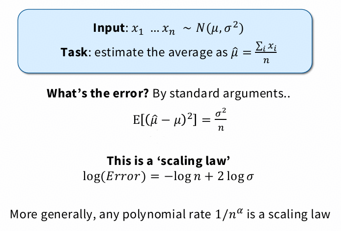
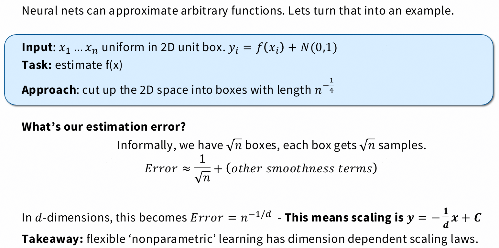
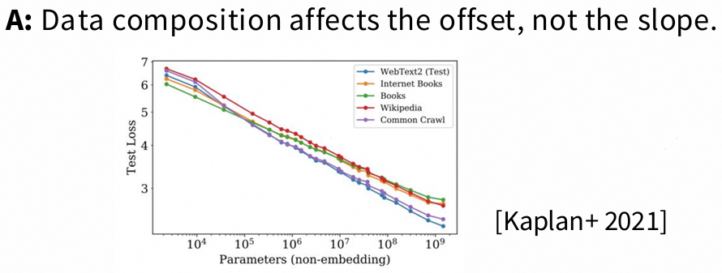
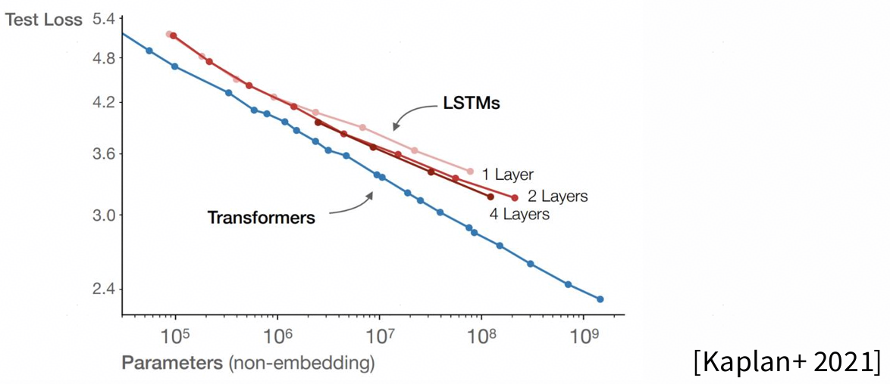
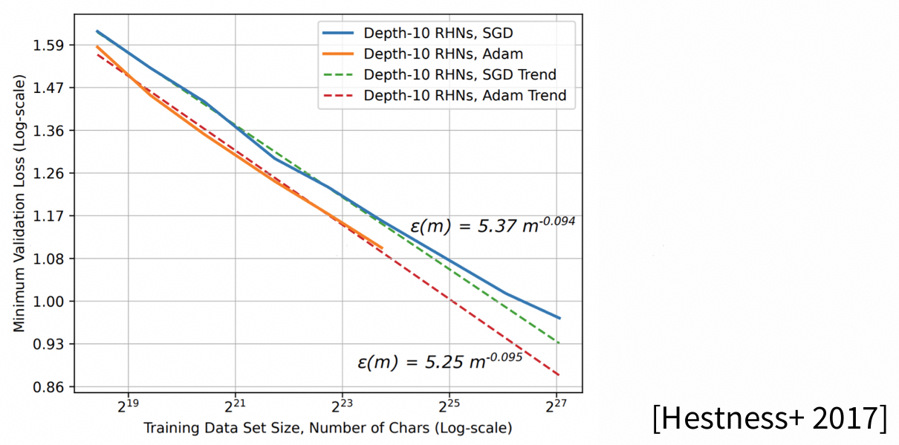
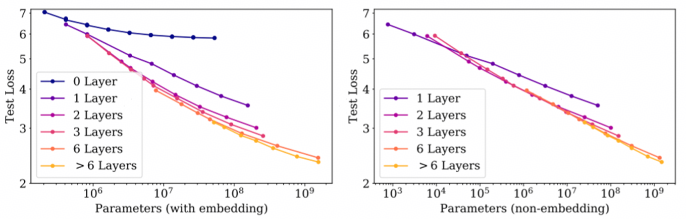
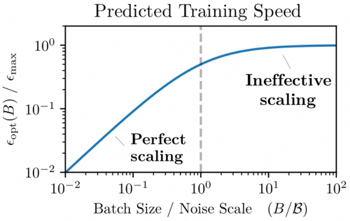

# lecture 9: SCALING LAWS {ignore true}

## 目录{ignore true}

[toc]

## 1 Data vs performance

- 数据集越大，性能越好，一定范围内近乎线性

### 1.1 两个例子

第一个例子：

这里可以推导：

1. **样本均值的期望**（无偏性）：
   $$
   \mathbb{E}[\bar{X}] = \mathbb{E}\left[ \frac{1}{n} \sum_{i=1}^{n} X_i \right] = \frac{1}{n} \sum_{i=1}^{n} \mathbb{E}[X_i] = \frac{1}{n} \cdot n \mu = \mu
   $$

2. **样本均值的方差**（利用独立性）：
   $$
   \operatorname{Var}(\bar{X}) = \operatorname{Var}\left( \frac{1}{n} \sum_{i=1}^{n} X_i \right) = \frac{1}{n^2} \sum_{i=1}^{n} \operatorname{Var}(X_i) = \frac{1}{n^2} \cdot n \sigma^2 = \frac{\sigma^2}{n}
   $$

3. **均方误差（MSE）分解**：
   $$
   \mathbb{E}\left[ (\bar{X} - \mu)^2 \right] = \operatorname{Var}(\bar{X}) + \left( \mathbb{E}[\bar{X}] - \mu \right)^2 = \frac{\sigma^2}{n} + 0 = \frac{\sigma^2}{n}
   $$

这里推导得到的形式是$y = -x + C$，但实际上的scaling law到不了这么好，于是看第二个例子：

可以看到，假如把数据分为d个维度，那么最终按照上述例子估算下来的关系式就变为了$y = -\frac{1}{d}x + C$，这样斜率是变化的而不再是1，更加符合`Machine translation`，`Speech`，`Language modeling`等等不同场景下的斜率情况。因此这里大胆推测：

- **data与performance的scaling law的斜率，可能与数据的内在维度(intrinsic dimensionality)有关系**
- **数据构成影响截距**
    

### 1.2 启发

- 可以利用小模型选择最优数据组合
- 决定是否重复使用数据
- 结合上述两者，平衡数据质量与重复率

## 2 model scaling

### 2.1 Architecture: transformers vs LSTMs

- transformer比LSTM scaling能力更强，更易保持线性scaling law：

### 2.2 Optimizer choice

- ADAM比SGD收敛更快，scaling law曲线上截距更小：

### 2.3 Depth/Width: Number of layers

- 模型层数增加对模型scaling有益，但层数增加到6层之后收益会变缓

### 2.4 Batch size: Critical batch size

- 临界batch size：让loss保持线性变化的最大batch size：

### 2.5 Learning rates: muP and scale-aware LR choices

- 最优学习率可能跟规模密切相关，因此可能需要设定具备规模感知的学习率及初始化方法

## 3 应用

### 3.1 训练要点

- 训练一些小模型
- 观察scaling情况，构建scaling law关系
- 选择最优超参数

### 3.2 Joint data-model scaling laws

可以根据如下公式来进行scaling law的拟合，一般比较准：

$$
\begin{align}
    Error &= n^{-\alpha} + m^{-\beta} + C \\
    n: \; & \; data规模 \\
    m: \; & \; model规模
\end{align}
$$

### 3.3 如何寻找scaling laws中的最优参数

#### 3.3.1 Minimum over runs（逐点取最小值法）

- **定义**：对每一个固定的计算量（FLOPs）或模型规模，从所有已完成的训练实验中，选取在该计算量下验证损失（或误差）最低的那个实验结果。
- **目的**：构建一个“经验下界”曲线，代表在给定计算预算下所能达到的最佳性能。
- **优点**：无需建模假设，直接反映实验数据中的最佳表现。
- **缺点**：依赖于已有实验的覆盖密度；若某些区域缺乏实验，则无法准确估计。

> **举例**：若有多个实验使用了相近的 FLOPs（比如都在 $10^{20}$ FLOPs 附近），就取其中 loss 最小的那个点作为该 FLOPs 下的代表。

#### 3.3.2 IsoFLOPS（等计算量曲线拟合法）

- **定义**：固定总计算量（FLOPs），在模型参数量 $N$ 和训练 token 数 $D$ 之间进行权衡（因为 $\text{FLOPs} \approx 6ND$），拟合出在该 FLOPs 下 loss 最低的 $N:D$ 比例。
- **目的**：找出在固定计算预算下，如何分配模型大小与数据量以获得最优性能。
- **方法**：通常对每个 FLOPs 预算，拟合一个关于 $N$ 或 $D$ 的 loss 曲面，并找到最小值点。
- **关键结论**：Chinchilla 论文发现，在固定 FLOPs 下，较小模型 + 更多数据往往优于大模型 + 少数据。

> **公式近似**：$\text{FLOPs} \approx 6 \times N \times D$ → 对于固定 FLOPs，$D = C / N$，代入 loss 模型后优化。

#### 3.3.3 Joint fits（联合拟合法）

- **定义**：使用一个统一的参数化函数（如幂律模型）同时拟合所有实验数据，loss 被建模为模型大小 $N$ 和数据量 $D$ 的函数：
  $$
  L(N, D) = \left( \frac{A}{N^\alpha} + \frac{B}{D^\beta} \right)
  $$
  或更完整的形式：
  $$
  L(N, D) = \left( \frac{E}{N^\alpha} + \frac{E}{D^\beta} + L_0 \right)
  $$
- **目的**：通过全局拟合学习缩放律的通用形式，从而预测任意 $(N, D)$ 组合下的性能，并推导出最优缩放路径（如 Chinchilla 的 $N \propto D$）。
- **优点**：可外推、提供解析最优解；适合指导未来实验设计。
- **挑战**：依赖模型假设是否合理；对噪声敏感。

> 通过 joint fit 可以导出：最优情况下 $N \propto D$，即模型大小与数据量应同步增长。

#### 3.3.4 总结对比

| 方法                | 是否需要建模 | 是否可外推 | 主要用途 |
|---------------------|--------------|------------|----------|
| Minimum over runs   | 否           | 否         | 经验下界，评估当前实验效果 |
| IsoFLOPS            | 是（局部）   | 有限       | 固定计算预算下的最优配比 |
| Joint fits          | 是（全局）   | 是         | 推导通用缩放律，指导未来训练 |

这三种方法常结合使用：先用 **minimum over runs** 看实际能达到的性能，再用 **IsoFLOPS** 分析特定预算下的权衡，最后用 **joint fits** 建立理论模型并预测最优配置。
