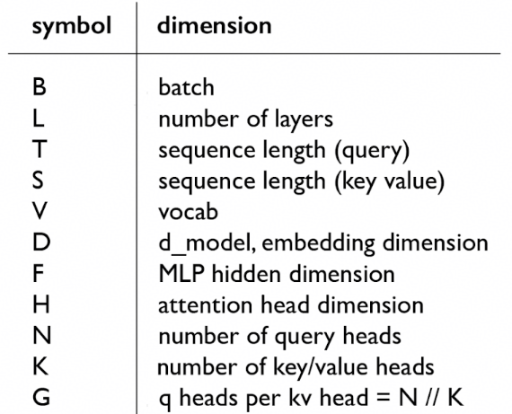
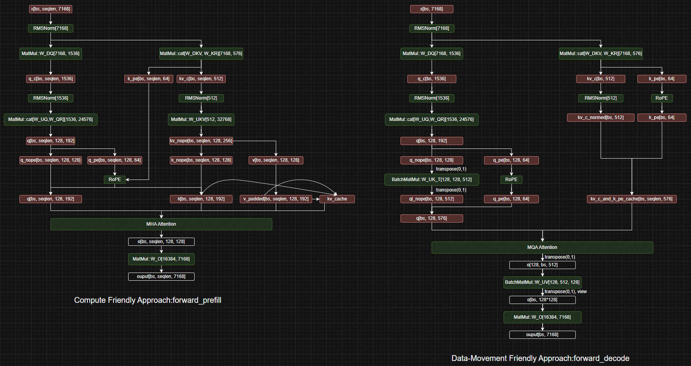
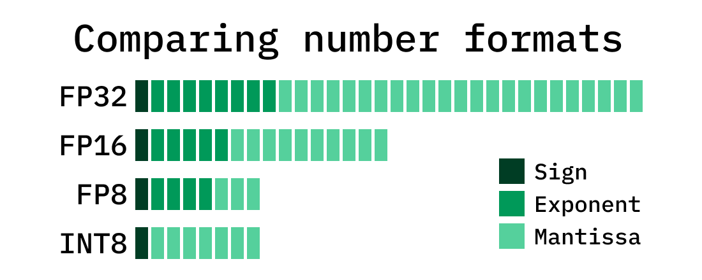
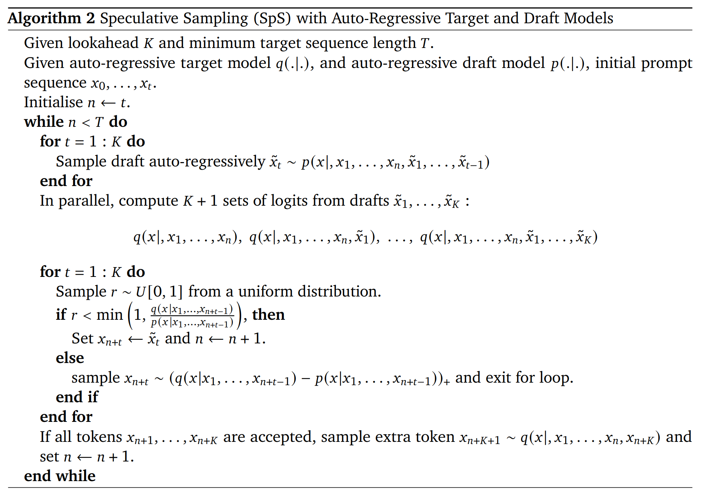

# lecture 10: inference {ignore true}

## 目录{ignore true}

[toc]

## 1 介绍

一些定义：
- Time-to-first-token (TTFT): prefill延时
- Latency (seconds/token) or TPOT: decode延时
- Throughput (tokens/second): 批推理时的吞吐量
- Inference: 利用已有权重进行内容生成

## 2 算数强度

首先做如下约定：



只计算矩阵乘的访存与计算

### 2.1 MLP层

参考[教材](https://stanford-cs336.github.io/spring2025-lectures/?trace=var%2Ftraces%2Flecture_10.json&step=114)：
$$
    intensity \approx B*T
$$

那么自然有：
- prefill: compute bound，因为B、T可以较大
- decode: memory bound，因为T=1，且B可能较小（仅有部分批次在decode）

### 2.2 Attention层

参考[教材](https://stanford-cs336.github.io/spring2025-lectures/?trace=var%2Ftraces%2Flecture_10.json&source=lecture_10.py&line=213)：
$$
    intensity \approx S*T / (S + T)
$$

这里值得注意的是，算术强度与B无关，可以这样理解：
- B不会影响attention中矩阵乘计算的维度，增加B只是增加batch matmul的batch也就是循环次数，不会影响算术强度。

那么自然有：
- prefill: $prefill\_intensity \approx S/2$，compute bound，因为S可以较大
- decode: $docode\_intensity \approx S/(S+1) < 1$，memory bound

### 2.3 总结

大体上来说：
- prefill是compute bound，decode是memory bound
- decode阶段，MLP算数强度是B，attention算数强度是1

## 3 吞吐和延时

```
memory = B * kv_cache_size + parameter_size
latency = memory / memory_bandwidth
throughput = B / latency
```

可以想见，相同模型下，随着B的增加，延时和吞吐之间存在着trade-off

## 4 优化方法

### 4.1 减少kv cache

为什么有效？因为延时与memory直接相关，而kv_cache_size会直接影响memory占用

#### 4.1.1 MHA -> GQA -> MQA -> MLA

关于MLA可以参考[下图](https://github.com/MiyaaL/techflow/blob/main/deepseekv2_mla.drawio):



deepseek文章中做的消融实验，performance来说，MLA>MHA>GQA>MQA，即使MLA更轻量

#### 4.1.2 其他的：CLA, Local attention

- **CLA(Cross-layer attention)**: 顾名思义就是跨层共享KV_cache
- **Local attention**: 只使用局部的KV_cache，距离太远的丢弃掉，为了避免损失精度所以需要交织的使用Local attention和Global attention

### 4.2 transformer变种

#### 4.2.1 SSM

- 线性注意力：SSM -> S4 -> Mamba -> Jamba(transformer和mamba层交织)

现在主流LLM的线性注意力都不是完全的线性注意力，最多是transformer+SSM混合注意力

这里介绍的很简单，之后有时间单独写一篇文章，先空着。

#### 4.2.2 Diffusion models

- **核心idea：** 一次性生成所有token，之后再慢慢精炼，可以参考[视频](https://x.com/_inception_ai/status/1894847919624462794)

### 4.3 quantization

- **核心idea：** 降低计算精度换取访存性能，更低精度的权重意味着更少的访存量



- **FP32**: E8M23
- **FP16**: E5M10
- **BF16**: E8M7
- **FP8**:  E4M3、E5M2

#### 4.3.1 AWQ 量化

这里简单过了一下AWQ量化，可以参考[知乎](https://zhuanlan.zhihu.com/p/681578090)。基本原理是认为权重并不都一样重要，有的重要权重在量化时可以尽量保精。

##### 4.3.1.1 出发点

首先是权重计算：
$$
    y = wx = (w \cdot s) \cdot (x/s)
$$
这里通过一个等价变化，将某些重要的权重通道，乘以了s>1（也就是scale）进行了放大，放大后的权重$w^\prime = w \cdot s$再去进行量化，就可以保证这部分重要权重尽量不被下溢影响。

##### 4.3.1.2 误差分析

普通量化采用最大值来进行缩放，那么有：
$$
\begin{align}
    Q(w) &= \Delta \cdot Round(\frac{w}{\Delta}) \\
    \Delta &= \frac{max(|w|)}{2^{N-1}}
\end{align}
$$

缩放完毕之后，有：
$$
\begin{align}
    Q(w \cdot s) \cdot \frac{x}{s} &= \Delta^\prime \cdot Round(\frac{ws}{\Delta^\prime}) \cdot \frac{x}{s} \\
    \Delta^\prime &: 新的量化缩放参数
\end{align}
$$

那么有：
$$
\begin{align}
    Err(Q(w)x) &= \Delta \cdot RoundErr(\frac{w}{\Delta}) \cdot x \\
    Err(Q(w \cdot s) \cdot \frac{x}{s}) &= \Delta^\prime \cdot RoundErr(\frac{ws}{\Delta^\prime}) \cdot \frac{x}{s}
\end{align}
$$

这里，对比两个误差，我们认为：
$$
\begin{align}
    RoundErr(\frac{w}{\Delta}) &= RoundErr(\frac{ws}{\Delta^\prime}) \\
    \frac{Err(Q(w \cdot s) \cdot \frac{x}{s})}{Err(Q(w)x)} &= \frac{\Delta^\prime}{\Delta} \cdot \frac{1}{s}
\end{align}
$$

那么在$\Delta^\prime \approx \Delta, s > 1$时，新的误差是要更小的，也就是说这样量化的精度是更高的。

### 4.4 distillation

这里介绍的非常简单，总体来说就是：
1. 识别重要层、参数
2. 删除不重要的层
3. 蒸馏得到剪枝模型

### 4.5 投机采样

一般来说是下面的流程：



这里可以看到，当$q \gt p$时，draft model得到的token是一定会被接受的；而当$q \lt p$时，则以$\frac{q}{p}$概率接受，否则拒绝，并从残差分布（residual distribution）中重新采样。为了验证这种采样方式与原来是等价的，可以简单证明如下：

1. 初始变量
- $\{A, B\}$: 两个候选token
- $[q(A), q(B)]$: 主模型的概率
- $[p(A), p(B)]$: 草稿模型的概率
- $p(A) > q(A), p(B) < q(B)$: 假设草稿模型更青睐于A token

2. 实际概率
要想采样到A，只能是通过草稿模型采到A并被接受，因为残差分布中不可能采样到A（q(A) - p(A) < 0），那么：
- $P[sampling A] = p(A) \cdot \frac{q(A)}{p(A)} = q(A)$

而要想采样到B，可能是：
- 草稿采到B并被接受
- 草稿采到A，但被拒绝，然后从残差中采到B

所以：
- $P[sampling B] = p(B) + p(A) \cdot (1-\frac{q(A)}{p(A)}) = q(B)$

3. 最终，投机推理的采样结果与主模型本身的推理结果在概率上保持一致

### 4.6 continuous batching

- 核心idea：推理服务时可能会在不同时间段陆续收到推理请求，可以把这些请求进行合并：
    - attention分别计算，因为序列长度不同、KV_cache不同
    - 非attention可以在序列长度方向concat在一起计算，不影响结果且效率更高
- 实现可以参考vllm

### 4.7 paged attention

- 对KV_cache进行分页管理，否则碎片化会比较严重。并且多个相同的seq段可以共享同一段KV_cache（copy-on-write，直到遇到未计算过的KV_cache再写入page），system prompt对应的KV_cache也可以做到全局共享。
- 实现参考vllm